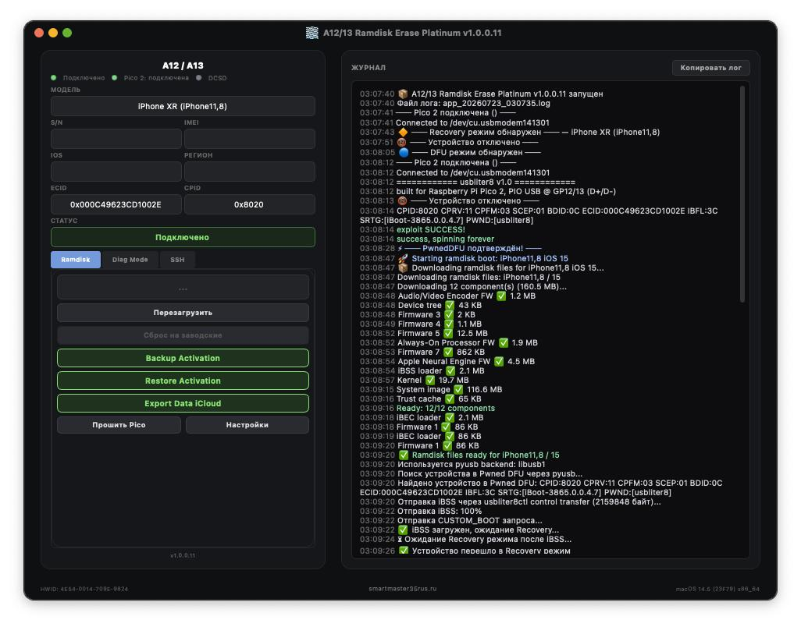
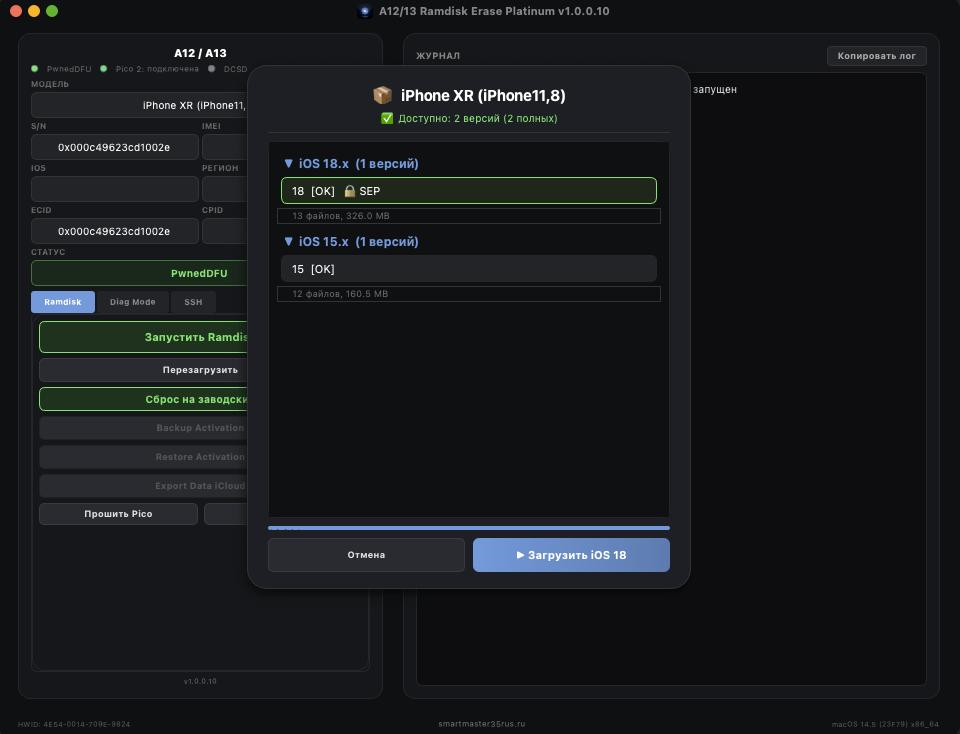

# A12/A13 Ramdisk Erase Platinum

Профессиональный инструмент для работы с устройствами Apple A12/A13 (iPhone XR/XS/XSMAX/11/11PRO/11PROMAX/SE2/IPAD8/IPAD9) от [SmartMaster35Rus](https://smartmaster35rus.ru)

> [!WARNING]
> Все действия выполняются на ваш страх и риск. Разработчик не несет ответственности за потерю данных, повреждение устройства или юридические последствия.

  

  

## Возможности

- 🚀 Загрузка кастомного SSH-рамдиска на A12/A13 устройства
- 📱 Чтение/запись серийного номера, WiFi/BT MAC через Diag режим (DCSD)
- 💾 Резервное копирование и восстановление активации
- 📦 Экспорт данных iCloud и FairPlay
- 🔧 Полный сброс устройства (Factory Reset)
- 🎨 Свой логотип при загрузке рамдиска
- 🔒 Защита по ECID — доступ только для зарегистрированных устройств

## Системные требования

- macOS 11+ или Windows 10/11
- Pico 2 (RP2350) с прошивкой usbliter8
- Для Diag режима — DCSD кабель

## Быстрый старт

1. Запустите A12/13 Ramdisk Erase Platinum
2. Подключите Pico 2 и устройство в DFU
3. Нажмите «Начать» → PwnedDFU
4. Выберите версию iOS и нажмите «Boot Ramdisk»
5. После загрузки: SSH root@localhost:1337 (пароль: alpine)

## Контакты

- [smartmaster35rus.ru](https://smartmaster35rus.ru)
- Telegram: [@smartmaster35rus](https://t.me/smartmaster35rus)
